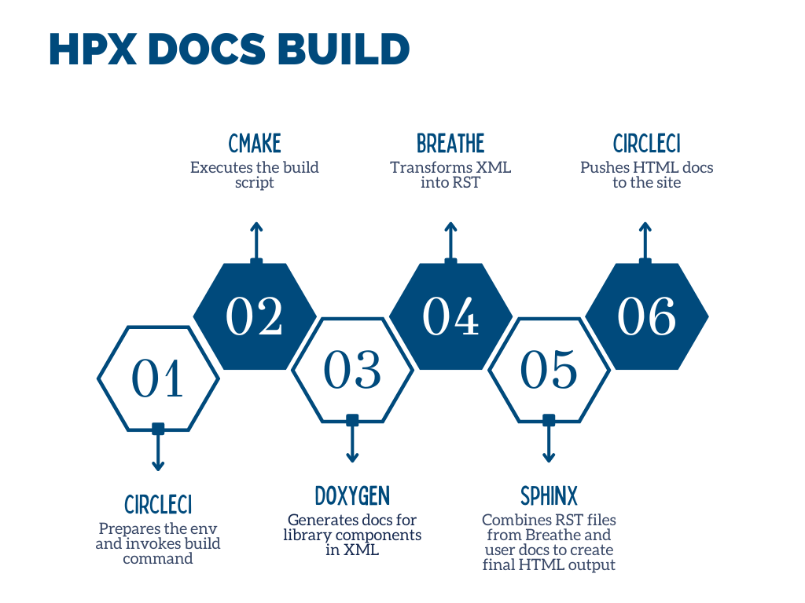

<!-- GSoD 2022 with HPX -->

## What is GSoD?

GSoD stands for [Google Season of Docs](https://developers.google.com/season-of-docs) and is a program run by [Google](https://about.google/) with the intent of improving documentation of open-source projects. Each year, Google sponsors technical writers hired by some open-source organizations for a period of about six months. These organizations are chosen by Google and the writers, in turn, are chosen by selected organizations.

GSoD is unique and frankly, very important because it puts the spotlight on documentation – often overlooked but quite crucial for a project's utility and success.

## What is HPX?

[HPX documentation](https://hpx-docs.stellar-group.org/latest/html/index.html) says:

HPX is a C++ Standard Library for Concurrency and Parallelism. It implements all of the corresponding facilities as defined by the C++ Standard.

The goal of HPX is to create a high quality, freely available, open source implementation of a new programming model for conventional systems, such as classic Linux based Beowulf clusters or multi-socket highly parallel SMP nodes.

HPX gets its edge from a new execution model called [ParalleX](https://hpx-docs.stellar-group.org/latest/html/why_hpx.html#parallex-a-new-execution-model-for-future-architectures). HPX is the first runtime implementation of ParalleX. HPX is quite comprehensive and supports a plethora of platforms.

## Overview of current HPX documentation build system and structure

[CMAKE](https://cmake.org/), [Doxygen](https://www.doxygen.nl/), [Breathe](https://github.com/breathe-doc/breathe) and [Sphinx](https://www.sphinx-doc.org/en/master/) work together to build current HPX documentation.

Documentation for library components is written in source files themselves in the form of Doxygen comments. User documentation is written in [reStructuredText](https://en.wikipedia.org/wiki/ReStructuredText) files located at `docs/sphinx/`.

Doxygen is an excellent tool but like everything, it has its limitations. Docs generated by Doxygen are not very visually appealing and tend to be a bit cluttered. Doxygen also doesn’t support a broad markup language. You have to rely on Doxygen directives or Markdown which are great for documenting simple things but once projects start getting bigger and more complex, the need for a more modular, extensible system is felt.

Enter Sphinx! Sphinx is a documentation generator primarily used by the Python community. Sphinx uses reStructuredText which is modular and great for large projects. Sphinx is highly configurable, extensible and provides fine-grained control over the output.

Sphinx, however, cannot understand C++ or Doxygen comments. Enter Breathe! Breathe acts as a bridge between Doxygen and Sphinx. Breathe translates documentation generated by Doxygen in a format understood by Sphinx (reStructuredText).

This is how the process looks:

1. Doxygen generates documentation for library components in XML format.
2. XML output of Doxygen is fed to Breathe.
3. Breathe translates the XML and feeds it to Sphinx.
4. Sphinx combines documentation for library components and user documentation to generate final output in various formats like LaTeX, HTML and PDF.

This whole process is automated using CMAKE.

Whenever a commit is pushed to the `master` branch, docs are generated and pushed to <https://hpx-docs.stellar-group.org/branches/master/html/index.html> by [CircleCI](https://circleci.com/) based on the Dockerfile found [here](https://github.com/STEllAR-GROUP/docker_build_env/blob/master/hpx_build_env/Dockerfile). Same applies to the [latest release](https://hpx-docs.stellar-group.org/latest/html/index.html).

## 2022 run

### Goals and beginning of the program

HPX's last GSoD effort centered on enhancing the presentation of the documentation. This involved making it less cluttered and more user-friendly as well as visually appealing. With that goal accomplished, HPX redirected its efforts towards enhancing documentation content in this iteration.

As I mentioned previously, HPX is quite vast. It has hundreds of classes, methods and functions. Many of these elements lacked up-to-date or any documentation at all. This issue of outdated documentation was exacerbated by the fact that Doxygen doesn’t support a lot of modern C++ directives and concepts like `tag_invoke`. These are used extensively by HPX. Since Doxygen doesn’t support them, class and function declarations need to be duplicated. These duplicated declarations also need to be synchronized with actual code whenever there is a change.

At the beginning, an all-encompassing goal of improving documentation content was set. We decided to fix issues as we find them with critical sections getting priority. It was also decided to (virtually) meet every week to discuss the progress and blockers. Other communication was done asynchronously through IRC.

### Work done

#### Content

Parallel versions of algorithms implemented by the standard library are HPX’s core offering and fixing their documentation was the highest priority for obvious reasons. Documenting these algorithms is also quite tedious because they have tons of overloads that use mechanisms not currently supported by Doxygen. Each declaration has to be duplicated and then updated every time there is a change in the actual code. These declarations do not change often but HPX went through a large effort that included auditing all algorithms currently implemented and modifying their declarations to align them with the standard library. Unfortunately, HPX’s documentation had not been successful in keeping up with these changes. In the end, the code itself saw a significant improvement, however, documentation was incorrect due to it being out of sync with the actual interfaces.

There are approximately 60 algorithms and my task was to fix documentation of all of them. I was able to do this gradually over a couple months.

Once this was done, I documented other headers like `mutex` and `condition_variable`.

#### Improvements in conformance with the standard API

While I was fixing documentation of HPX algorithms, I was also going through documentation of standard library algorithms. In this process, I was able to identify discrepancies between HPX’s API and standard library API. HPX puts great emphasis on conformance to the standard library and consequently, these deviations were either fixed or are due to be fixed soon. It should be noted that this was not planned at all. So, the next time you’re on a mission to hunt down those pesky bugs, give sprucing up the docs a serious thought! ;)

#### Resolving stealthy bugs in the HPX build system

HPX’s documentation build system has gone through a lot of changes and the most significant one of them were integrating Doxygen output with Sphinx and automating the integration using Breathe. During these changes, the previous build system was not removed properly and the remnants were still present. This led to parallel builds, which in turn led to a variety of bugs and difficulties in understanding the actual build system. I identified and fixed this.

Current documentation build system also had bugs which were very hard to spot but caused massive problems. For example, Sphinx config file created RST doc files from source files and placed them into appropriate folders for better structuring of the docs but when it did that, only names of the files were considered – not their complete path. This was done in a for loop and everytime the loop encountered a filename that had been processed before, it overwrote documentation of the previous file with documentation of the current file. HPX has a lot of files with similar names and this affected all of them. I fixed this [here](https://github.com/STEllAR-GROUP/hpx/pull/5915).

HPX docs take hours to build even with multiple cores in use, so every time you want to replicate a bug or try out a fix, you need to wait for a long time. This makes build system bugs very hard to work on.

#### Adding CPPReference named requirements support

I added support for named requirements, which were previously unsupported in the HPX documentation.
<Cppreference.com> is the most popular reference documentation site for C++ at the moment and it supports [named requirements](https://en.cppreference.com/w/cpp/named_req). Named requirements are requirements used in the normative text of the C++ standard to define the expectations of the standard library. Failure to comply with these can result in very complex compiler diagnostics and huge error messages.

#### Miscellaneous

There are also a lot of other small changes I made like [changing Doxygen configuration to reduce boilerplate required](https://github.com/STEllAR-GROUP/hpx/pull/6022).

### End of the program

At the end of the program, I was required to prepare a report detailing work done during GSoD ‘22. You can find the report [here](https://github.com/STEllAR-GROUP/hpx/wiki/GSoD-2022-Project-Report).

### Takeaways and acknowledgements

Doing GSoD with HPX was a great experience and I learned a lot of things.

My understanding of the standard library and what each algorithm does has increased leaps and bounds. I’m also aware of the common pitfalls during usage and implementation intricacies of various components now that I have documented them myself for HPX.

HPX uses template-heavy, cutting-edge C++ and just going through code has done wonders for my understanding of C++. The support modern C++ provides for templates is simply mind-boggling. Real talk – if you ever wondered what you can achieve with templates or just want to see some exotic C++ in action, start going through HPX’s source code. My metaprogramming skills have improved significantly and templates I write now are much cleaner and well thought out.

HPX’s documentation is vast and doing GSoD ‘22 with HPX gave me a chance to understand how large projects handle their documentation. GSoD has done wonders for my technical writing, RST, Doxygen and Sphinx skills.

My mentor for the program was [Hartmut Kaiser](https://www.lsu.edu/eng/cse/people/faculty/kaiser.php). I’m yet to encounter someone who surpasses Hartmut in their proficiency with C++ and concurrency. He is an excellent programmer and even better mentor. He was patient, available, managed my workload aptly and always provided constructive feedback. I couldn’t have asked for a better mentor. I was also supported by a developer – [Ioannis Gonidelis](https://github.com/gonidelis) and another technical writer – [Dimitra Karatza](https://github.com/dimitraka).

Thank you for the wonderful GSoD, [Ste||ar Group](https://stellar-group.org/)!
